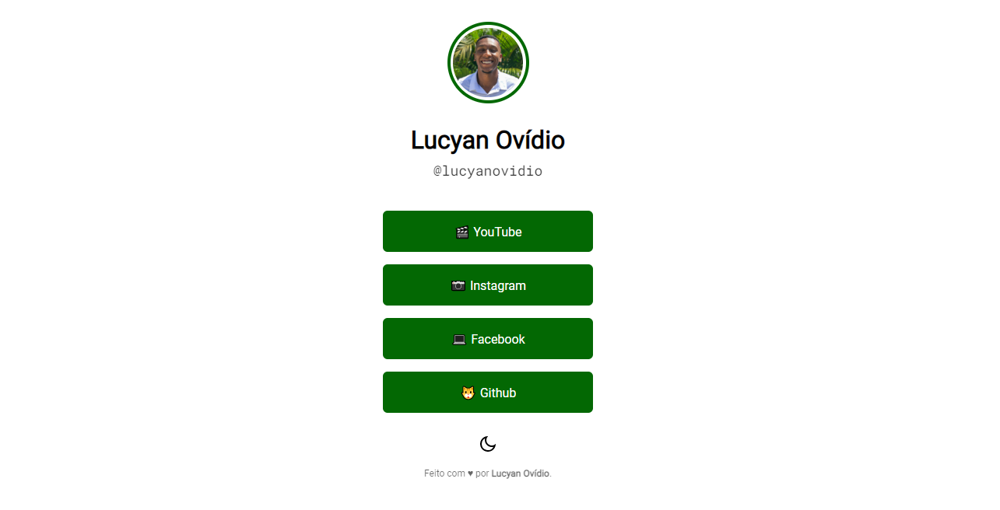

# Maratona Explorer 2 📱

> <a href="https://lucyanovidio.github.io/maratonas-explorer-rocketseat/maratona-explorer-2/">Acesse aqui 🚀</a>

## 💻 Sobre

Na maratona 2 desenvolvemos uma página de links, parecida com páginas de links usadas para biografia em perfil do Instagram.
O projeto propõe:
+ Imagem, nome e nickname do usuário;
+ Links com a tag ***a***.

Adicionei alguns detalhes:
+ Pequeno efeito de *hover* na imagem e nos botões;
+ Aternação simples de tema *light* para *dark*.

## 🧠 Tecnologias

    
    
    

## 🚀 Extra

A partir dos conhecimentos obtidos neste evento, desenvolvi uma página de links para cliente. Acesso abaixo.
+  <a href="https://github.com/lucyanovidio/robertoovidionutri-bio">Repositório</a>
+  <a href="https://lucyanovidio.github.io/robertoovidionutri-bio">Deploy</a>
 

---

<table>
  <tr>
    <td>
      
    </td>
    <td>
      
    </td>
    <td>
      Feito por <a href="https://github.com/lucyanovidio">Lucyan Ovídio</a> 🙋🏿‍♂️
        Junto com <a href="https://rocketseat.com.br">Rocketseat</a> 🚀.
    </td>
  </tr>
</table>
