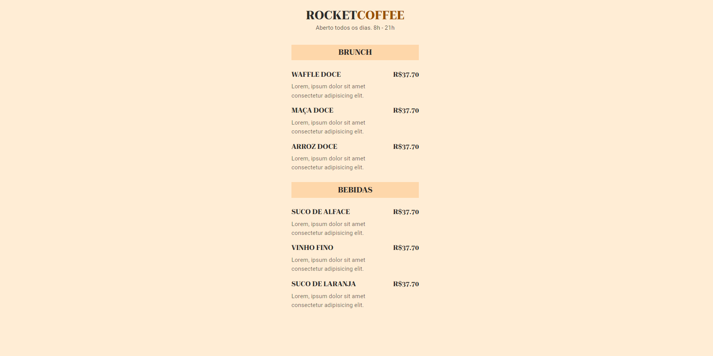

# Maratona Explorer 3 ☕

> <a href="https://lucyanovidio.github.io/maratonas-explorer-rocketseat/maratona-explorer-3/">Acesse aqui 🚀</a>

## 💻 Sobre

Na maratona 3 desenvolvemos uma página de cardápio para um restauirante fictício, no intuito de praticarmos conceitos básicos.

## 🧠 Tecnologias

    
    

<!--
## 🚀 Extra

A partir dos conhecimentos obtidos neste evento, desenvolvi o projeto ***Roll the dice***.
+  <a href="https://github.com/lucyanovidio/roll-the-dice">Repositório</a>
+  <a href="https://lucyanovidio.github.io/roll-the-dice">Deploy</a>
--->
 

---

<table>
  <tr>
    <td>
      
    </td>
    <td>
      
    </td>
    <td>
      Feito por <a href="https://github.com/lucyanovidio">Lucyan Ovídio</a> 🙋🏿‍♂️
        Junto com <a href="https://rocketseat.com.br">Rocketseat</a> 🚀.
    </td>
  </tr>
</table>
